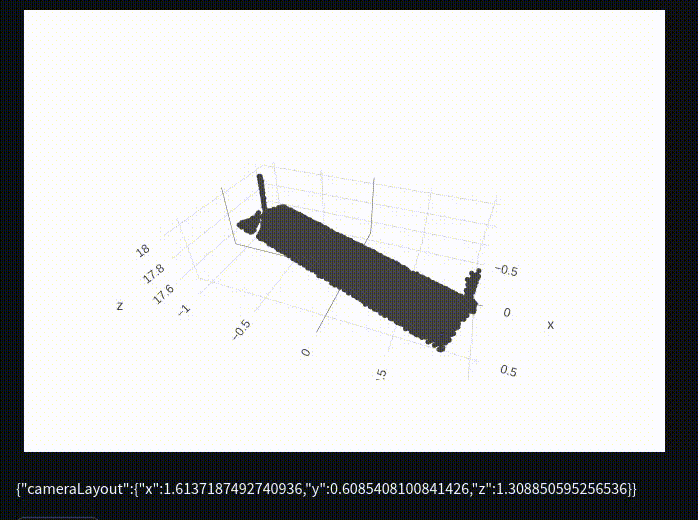

# 🔥📊📣 Streamlit Plotly Events 📣📊🔥
Ever wanted to harness those awesome events from Plotly charts inside of Streamlit?  So did I, so now you can!



## Overview, TL;DR
### Installation
Install via Pip!

```pip install streamlit-plotly-events```

### Usage
Import the component, and use it like any other Streamlit custom component!
```python
import plotly.express as px
import streamlit as st

from streamlit_plotly_events import plotly_events

# Writes a component similar to st.write()
fig = px.line(x=[1], y=[1])
selected_points = plotly_events(fig)

# Can write inside of things using with!
with st.expander('Plot'):
    fig = px.line(x=[1], y=[1])
    selected_points = plotly_events(fig)

# Select other Plotly events by specifying kwargs
fig = px.line(x=[1], y=[1])
selected_points = plotly_events(fig, click_event=False, hover_event=True)
```

What the component returns:
```
Returns
    -------
    list of dict
        List of dictionaries containing point details (in case multiple overlapping
        points have been clicked).

        Details can be found here:
            https://plotly.com/javascript/plotlyjs-events/#event-data

        Format of dict:
            {
                x: float (x value of point),
                y: float (y value of point),
                z: float (z value of point), # optional enabled using with_z
                curveNumber: (index of curve),
                pointNumber: (index of selected point),
                pointIndex: (index of selected point)
            }

        If measurement is enabled:
            {
                x: float (x value of point),
                y: float (y value of point),
                z: float (z value of point), # optional enabled using with_z
                curveNumber: (index of curve),
                pointNumber: (index of selected point),
                pointIndex: (index of selected point)
            },
            {
                measurePointsX: (list of measurement points x value),
                measurePointsY: (list of measurement points y value),
                measurePointsZ: (list of measurement poitns z value),
                dx: (delta x of measurement points, 0 when only one point is clicked),
                dy: (delta y of measurement points, 0 when only one point is clicked),
                dz: (delta z of measurement points, 0 when only one point is clicked)
                dxyz: (delta xyz of measurement points, 0 when only one points is clicked)
                dxy: (delta xy of measurement points, 0 when only one point is clicked),
                dxz: (delta xz of measurement points, 0 when only one point is clicked),
                dyz: (delta yz of measurement points, 0 when only one point is clicked)
            }
        If get_relayout is enabled, additional returns will happen when the chart is moved around
        {
            cameraLayout: {
                x: float (x camera position)
                y: float (y camera position)
                z: float (z camera position)
            }
        }
        different dictionaries will be returned so you need to handle them

    

```

## Events
Currently, a number of plotly events can be enabled.  They can be enabled/disabled using kwargs on the `plotly_event()` function.
- **Click** `click_event` (defaults to `True`): Triggers event on mouse click of point
- **Select** `select_event`: Triggers event when points have been lasso
- **Hover** `hover_event`: Triggers event on mouse hover of point (**WARNING: VERY RESOURCE INTENSIVE**)

# Contributing
Please!  I'm hardly a frontend developer!  I think there's a bunch of amazing functionality we can add into streamlit/plotly!!

This repo follows `black` formatting standards for the Python parts of the project.

Follow the instructions on the `streamlit_components` [example repository](https://github.com/streamlit/component-template) to get up and running, or follow along below!

### Quickstart

* Ensure you have [Python 3.6+](https://www.python.org/downloads/), [Node.js](https://nodejs.org), and [npm](https://docs.npmjs.com/downloading-and-installing-node-js-and-npm) installed.
* Clone this repo.
* Create a new Python virtual environment for the template:
```
$ cd template
$ python3 -m venv venv  # create venv
$ . venv/bin/activate   # activate venv
$ pip install streamlit # install streamlit
$ pip install plotly # install plotly
```
* Initialize and run the component template frontend:
```
$ cd src/streamlit_plotly_events/frontend
$ npm install    # Install npm dependencies
$ npm run start  # Start the Webpack dev server
```
* From a separate terminal, run the template's Streamlit app:
```
$ cd src/streamlit_plotly_events
$ . venv/bin/activate  # activate the venv you created earlier
$ streamlit run __init__.py  # run the example server
```
